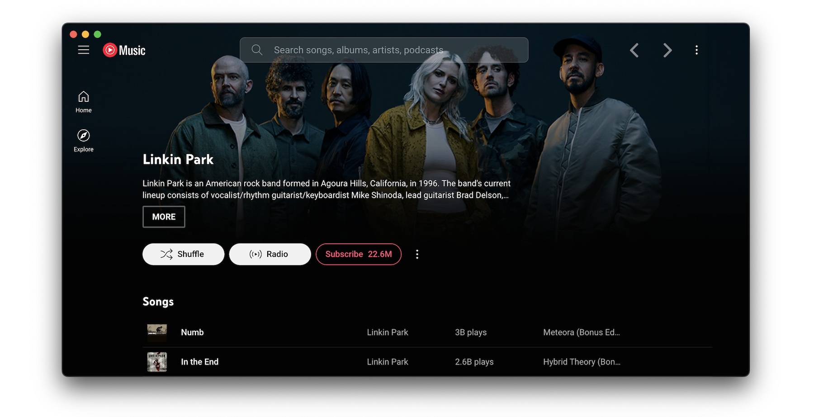

<div align="center">

# Veltune Desktop

[](https://github.com/VeltuneGroup/Veltune-Desktop/releases/)
[](https://github.com/VeltuneGroup/Veltune-Desktop/blob/main/license)
[](https://github.com/VeltuneGroup/Veltune-Desktop/actions)

</div>




Veltune Desktop is a community-maintained fork of the original YouTube Music desktop app.
It keeps the Electron wrapper and plugin system while continuing development, fixes, and maintenance.


## Contents

- [Features](#features)
- [Available plugins](#available-plugins)
- [Download](#download)
- [Themes](#themes)
- [Development](#development)
- [Build your own plugins](#build-your-own-plugins)
  - [Creating a plugin](#creating-a-plugin)
  - [Common use cases](#common-use-cases)
- [Build](#build)
- [Production Preview](#production-preview)
- [Tests](#tests)
- [License](#license)
- [FAQ](#faq)

## Features

- Native desktop wrapper for YouTube Music
- Plugin system for UI tweaks, quality-of-life improvements, and extra integrations
- Built-in settings for enabling, disabling, and configuring plugins
- Ongoing community maintenance in this fork

## Available plugins:

- **Ad Blocker**: Block all ads and tracking out of the box

- **Album Actions**: Adds Undislike, Dislike, Like, and Unlike buttons to apply this to all songs in a playlist or album

- **Album Color Theme**: Applies a dynamic theme and visual effects based on the album color palette

- **Ambient Mode**: Applies a lighting effect by casting gentle colors from the video, into your screen’s background

- **Audio Compressor**: Apply compression to audio (lowers the volume of the loudest parts of the signal and raises the
  volume of the softest parts)

- **Blur Navigation Bar**: makes navigation bar transparent and blurry

- **Bypass Age Restrictions**: bypass YouTube's age verification

- **Captions Selector**: Enable captions

- **Compact Sidebar**: Always set the sidebar in compact mode

- **Crossfade**: Crossfade between songs

- **Disable Autoplay**: Makes every song start in "paused" mode

- **[Discord](https://discord.com/) Rich Presence**: Show your friends what you listen to
  with [Rich Presence](https://user-images.githubusercontent.com/28219076/104362104-a7a0b980-5513-11eb-9744-bb89eabe0016.png)

- **Downloader**: downloads
  MP3 [directly from the interface](https://user-images.githubusercontent.com/61631665/129977677-83a7d067-c192-45e1-98ae-b5a4927393be.png) [(youtube-dl)](https://github.com/ytdl-org/youtube-dl)

- **Equalizer**: add filters to boost or cut specific range of frequencies (e.g. bass booster)

- **Exponential Volume**: Makes the volume
  slider [exponential](https://greasyfork.org/en/scripts/397686-youtube-music-fix-volume-ratio/) so it's easier to
  select lower volumes

- **In-App Menu**: gives bars a fancy, dark look

- **Scrobbler**: Adds scrobbling support for [Last.fm](https://www.last.fm/) and [ListenBrainz](https://listenbrainz.org/)

- **Lumia Stream**: Adds [Lumia Stream](https://lumiastream.com/) support

- **Lyrics Genius**: Adds lyrics support for most songs

- **Music Together**: Share a playlist with others. When the host plays a song, everyone else will hear the same song

- **Navigation**: Next/Back navigation arrows directly integrated in the interface, like in your favorite browser

- **No Google Login**: Remove Google login buttons and links from the interface

- **Notifications**: Display a notification when a song starts
  playing ([interactive notifications](https://user-images.githubusercontent.com/78568641/114102651-63ce0e00-98d0-11eb-9dfe-c5a02bb54f9c.png)
  are available on windows)

- **Picture-in-picture**: allows to switch the app to picture-in-picture mode

- **Playback Speed**: Listen fast, listen
  slow! [Adds a slider that controls song speed](https://user-images.githubusercontent.com/61631665/129976003-e55db5ba-bf42-448c-a059-26a009775e68.png)

- **Precise Volume**: Control the volume precisely using mousewheel/hotkeys, with a custom hud and customizable volume
  steps

- **Shortcuts (& MPRIS)**: Allows setting global hotkeys for playback (play/pause/next/previous), overriding media keys, enabling Ctrl/CMD + F to search, Linux MPRIS support, and custom hotkeys for advanced users

- **Skip Disliked Song**: Skips disliked songs

- **Skip Silences**: Automatically skip silenced sections

- [**SponsorBlock**](https://github.com/ajayyy/SponsorBlock): Automatically Skips non-music parts like intro/outro or
  parts of music videos where the song isn't playing

- **Synced Lyrics**: Provides synced lyrics to songs, using providers like [LRClib](https://lrclib.net).

- **Taskbar Media Control**: Control playback from
  your [Windows taskbar](https://user-images.githubusercontent.com/78568641/111916130-24a35e80-8a82-11eb-80c8-5021c1aa27f4.png)

- **TouchBar**: Custom TouchBar layout for macOS

- **Tuna OBS**: Integration with [OBS](https://obsproject.com/)'s
  plugin [Tuna](https://obsproject.com/forum/resources/tuna.843/)

- **Unobtrusive Player**: Prevents the player from popping up when playing a song

- **Video Quality Changer**: Allows changing the video quality with
  a [button](https://user-images.githubusercontent.com/78568641/138574366-70324a5e-2d64-4f6a-acdd-dc2a2b9cecc5.png) on
  the video overlay

- **Video Toggle**: Adds
  a [button](https://user-images.githubusercontent.com/28893833/173663950-63e6610e-a532-49b7-9afa-54cb57ddfc15.png) to
  switch between Video/Song mode. can also optionally remove the whole video tab

- **Visualizer**: Different music visualizers


## Download

Download builds from the [latest release](https://github.com/VeltuneGroup/Veltune-Desktop/releases/latest).

At the moment, this fork only documents direct GitHub releases. Old package-manager instructions from the original project were removed because they may no longer point to maintained packages for this fork.

Right now the README focuses on Windows distribution. Broader support for other operating systems is planned for the future as the fork matures.

### Windows

Microsoft Defender SmartScreen may still warn that the app is from an unknown publisher until builds are code-signed.

## Themes

You can load CSS files to change the look of the application (Options > Visual Tweaks > Themes).

Some predefined themes are available in https://github.com/kerichdev/themes-for-ytmdesktop-player.

## Development

```bash
git clone https://github.com/VeltuneGroup/Veltune-Desktop
cd Veltune-Desktop
pnpm install --frozen-lockfile
pnpm dev
```

## Build your own plugins

Using plugins, you can:

- manipulate the app - the `BrowserWindow` from electron is passed to the plugin handler
- change the front by manipulating the HTML/CSS

### Creating a plugin

Create a folder in `src/plugins/YOUR-PLUGIN-NAME`:

- `index.ts`: the main file of the plugin
```typescript
import style from './style.css?inline'; // import style as inline

import { createPlugin } from '@/utils';

export default createPlugin({
  name: 'Plugin Label',
  restartNeeded: true, // if value is true, ytmusic show restart dialog
  config: {
    enabled: false,
  }, // your custom config
  stylesheets: [style], // your custom style,
  menu: async ({ getConfig, setConfig }) => {
    // All *Config methods are wrapped Promise<T>
    const config = await getConfig();
    return [
      {
        label: 'menu',
        submenu: [1, 2, 3].map((value) => ({
          label: `value ${value}`,
          type: 'radio',
          checked: config.value === value,
          click() {
            setConfig({ value });
          },
        })),
      },
    ];
  },
  backend: {
    start({ window, ipc }) {
      window.maximize();

      // you can communicate with renderer plugin
      ipc.handle('some-event', () => {
        return 'hello';
      });
    },
    // it fired when config changed
    onConfigChange(newConfig) { /* ... */ },
    // it fired when plugin disabled
    stop(context) { /* ... */ },
  },
  renderer: {
    async start(context) {
      console.log(await context.ipc.invoke('some-event'));
    },
    // Only renderer available hook
    onPlayerApiReady(api: YoutubePlayer, context: RendererContext) {
      // set plugin config easily
      context.setConfig({ myConfig: api.getVolume() });
    },
    onConfigChange(newConfig) { /* ... */ },
    stop(_context) { /* ... */ },
  },
  preload: {
    async start({ getConfig }) {
      const config = await getConfig();
    },
    onConfigChange(newConfig) {},
    stop(_context) {},
  },
});
```

### Common use cases

- injecting custom CSS: create a `style.css` file in the same folder then:

```typescript
// index.ts
import style from './style.css?inline'; // import style as inline

import { createPlugin } from '@/utils';

export default createPlugin({
  name: 'Plugin Label',
  restartNeeded: true, // if value is true, ytmusic will show a restart dialog
  config: {
    enabled: false,
  }, // your custom config
  stylesheets: [style], // your custom style
  renderer() {} // define renderer hook
});
```

- If you want to change the HTML:

```typescript
import { createPlugin } from '@/utils';

export default createPlugin({
  name: 'Plugin Label',
  restartNeeded: true, // if value is true, ytmusic will show the restart dialog
  config: {
    enabled: false,
  }, // your custom config
  renderer() {
    // Remove the login button
    document.querySelector(".sign-in-link.ytmusic-nav-bar").remove();
  } // define renderer hook
});
```

- communicating between the front and back: can be done using the ipcMain module from electron. See `index.ts` file and
  example in `sponsorblock` plugin.

## Build

1. Clone the repo
2. Follow [this guide](https://pnpm.io/installation) to install `pnpm`
3. Run `pnpm install --frozen-lockfile` to install dependencies
4. Run the build command for the platform currently supported by this fork

- `pnpm dist:win` - Windows

Additional platform targets may return later as support for this fork expands.

## Production Preview

```bash
pnpm start
```

## Tests

```bash
pnpm test
```

Uses [Playwright](https://playwright.dev/) to test the app.

## License

MIT — see [`license`](./license)

## FAQ

### Why apps menu isn't showing up?

If `Hide Menu` option is on - you can show the menu with the <kbd>alt</kbd> key (or <kbd>\`</kbd> [backtick] if using
the in-app-menu plugin)
